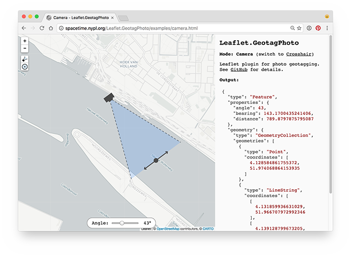
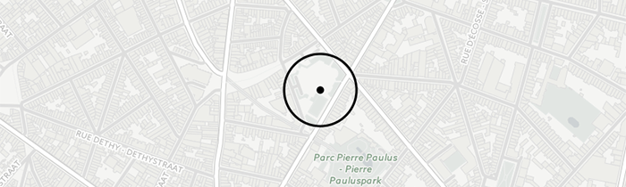

# Leaflet.GeotagPhoto

Leaflet plugin for photo geotagging.

Examples:

- [Crosshair mode](http://spacetime.nypl.org/Leaflet.GeotagPhoto/examples/crosshair.html)
- [Camera mode](http://spacetime.nypl.org/Leaflet.GeotagPhoto/examples/camera.html)

[](http://spacetime.nypl.org/Leaflet.GeotagPhoto/examples/camera.html)

Leaflet.GeotagPhoto is part of The New York Public Library's [NYC Space/Time Directory](http://spacetime.nypl.org/).

## Usage

Include the following HTML in your page's `<head>` tag:

```html
<link rel="stylesheet" href="https://unpkg.com/leaflet-geotag-photo/dist/Leaflet.GeotagPhoto.css" />
<script src="https://unpkg.com/leaflet-geotag-photo/dist/Leaflet.GeotagPhoto.min.js"></script>
```

## Modes

### `L.GeotagPhoto.Crosshair`



#### Example

```js
L.GeotagPhoto.crosshair().addTo(map)
  .on('input', function (event) {
    var point = this.getCrosshairPoint()
  })
```

#### API

`L.GeotagPhoto.Crosshair` extends [L.Evented](http://leafletjs.com/reference-1.0.0.html#evented).

| Function                            | Description                                     |
|:------------------------------------|:------------------------------------------------|
| `L.GeotagPhoto.crosshair(options?)` | Creation                                        |
| `addTo (map)`                       | Add `L.GeotagPhoto.Crosshair` to `map`          |
| `removeFrom (map)`                  | Remove `L.GeotagPhoto.Crosshair` from `map`     |
| `getCrosshairLatLng ()`             | Returns crosshair's [`LatLng`](http://leafletjs.com/reference-1.0.0.html#latlng) |
| `getCrosshairPoint ()`              | Returns crosshair's GeoJSON Point               |

#### Options

| Option    | Type          | Default                                               | Description
|:----------|:--------------|:------------------------------------------------------|:-------------|
| `element` | `HTML String` | `` | HTML string of crosshair element |

### `L.GeotagPhoto.Camera`


#### Example

```js
var cameraPoint = [6.83442, 52.43369]
var targetPoint = [6.83342, 52.43469]

var points = {
  type: 'Feature',
  properties: {
    angle: 20
  },
  geometry: {
    type: 'GeometryCollection',
    geometries: [
      {
        type: 'Point',
        coordinates: cameraPoint
      },
      {
        type: 'Point',
        coordinates: targetPoint
      }
    ]
  }
}

var options = {
  draggable: true
}

L.GeotagPhoto.camera(points, options).addTo(map)
  .on('change', function (event) {
    // Get camera field of view
    // See:
    //   https://github.com/nypl-spacetime/field-of-view#output
    var fieldOfView = this.getFieldOfView()
  })
```

#### API

`L.GeotagPhoto.Camera` extends [L.FeatureGroup](http://leafletjs.com/reference-1.0.0.html#featuregroup).

| Function                                  | Description                                     |
|:------------------------------------------|:------------------------------------------------|
| `L.GeotagPhoto.camera(feature, options?)` | Creation, `feature` is [input for field-of-view](https://github.com/nypl-spacetime/field-of-view#input) |
| `getFieldOfView ()`                       | Returns [field of view of camera](https://github.com/nypl-spacetime/field-of-view#output) |
| `getCameraLatLng ()`                      | Returns camera's [`LatLng`](http://leafletjs.com/reference-1.0.0.html#latlng) |
| `getTargetLatLng ()`                      | Returns target's [`LatLng`](http://leafletjs.com/reference-1.0.0.html#latlng) |
| `getCameraPoint ()`                       | Returns camera's GeoJSON Point                  |
| `getTargetPoint ()`                       | Returns target's GeoJSON Point                  |
| `getCenter ()`                            | Returns [`LatLng`](http://leafletjs.com/reference-1.0.0.html#latlng) of point halfway camera and target |
| `getBounds ()` | Returns [`LatLngBounds`](http://leafletjs.com/reference-1.0.0.html#latlngbounds) of field of view triangle |
| `centerBounds (bounds)`                   | Moves camera and target so their center lies in the middle of `bounds` |
| `setAngle (angle)`                        | Set angle of view                               |
| `setCameraLatLng (latLng)`                | Set `LatLng` of camera                          |
| `setTargetLatLng (latLng)`                | Set `LatLng` of target                          |
| `setCameraAndTargetLatLng (cameraLatLng, targetLatLng)` | Set `LatLng` of camera and `LatLng` of target |

#### Options

| Option         | Type      | Default | Description
|:---------------|:----------|:--------|:----------------------------------------------------------|
| `draggable`    | `Boolean` | `true`  | Whether the camera is draggable with mouse/touch or not   |
| `control`      | `Boolean` | `true`  | Whether to show camera control buttons                    |
| `cameraIcon`   | [`L.Icon`](http://leafletjs.com/reference-1.0.2.html#icon) | See below    | Camera icon
| `targetIcon`   | [`L.Icon`](http://leafletjs.com/reference-1.0.2.html#icon) | See below    | Target icon
| `outlineStyle` | [`L.Path options`](http://leafletjs.com/reference-1.0.2.html#path-option) | See below | Style of field-of-view triangle's outline
| `fillStyle`    | [`L.Path options`](http://leafletjs.com/reference-1.0.2.html#path-option) | See below | Style of field-of-view triangle's fill polygon

##### Defaults

```js
const defaults = {
  cameraIcon: L.icon({
    iconUrl: '../images/camera.svg',
    iconSize: [38, 38],
    iconAnchor: [19, 19]
  }),

  targetIcon: L.icon({
    iconUrl: '../images/target.svg',
    iconSize: [180, 32],
    iconAnchor: [90, 16]
  }),

  outlineStyle: {
    color: 'black',
    opacity: 0.5,
    weight: 2,
    dashArray: '5, 7',
    lineCap: 'round',
    lineJoin: 'round'
  },

  fillStyle: {
    weight: 0,
    fillOpacity: 0.2,
    fillColor: '#3388ff'
  }
}
```

#### Keyboard navigation

- Use `tab` to switch between map, camera and target
  - Use arrow keys to move map, camera or target
- Press `C` to move camera to center of current map view
- Press `M` to center map on current camera position

## See also

- http://spacetime.nypl.org/
- https://github.com/nypl-spacetime/field-of-view
- https://github.com/nypl-spacetime/surveyor
- http://turfjs.org/
