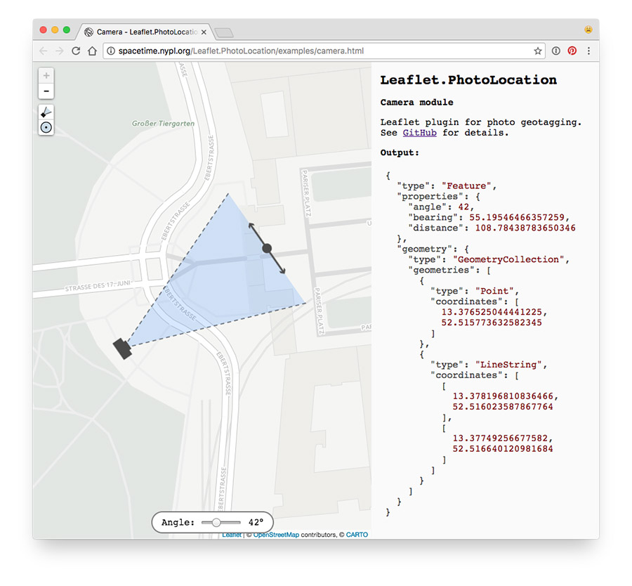

# Leaflet.GeotagPhoto

Leaflet plugin for photo geotagging.

Examples:

- Crosshair mode: http://spacetime.nypl.org/Leaflet.GeotagPhoto/examples/crosshair.html
- Camera mode: http://spacetime.nypl.org/Leaflet.GeotagPhoto/examples/camera.html

## Usage

## Modes

### Crosshair

#### API

#### Options

### Camera

#### Keyboard navigation

#### API

#### Options
